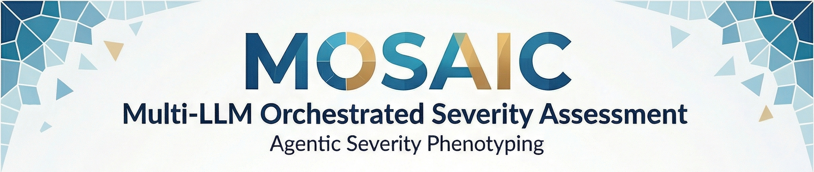

<p align="center">
  
</p>

<h1 align="center">🧩 MOSAIC</h1>

<h3 align="center"><b>M</b>ulti-LLM <b>O</b>rchestrated <b>S</b>everity <b>A</b>ssessment <b>I</b>n <b>C</b>linical Records</h3>

<p align="center"><i>Agentic Severity Phenotyping in Electronic Health Records</i></p>

<p align="center">
  
  
  
  
  
</p>

---

## 📖 What is MOSAIC?

**MOSAIC** is a multi-agent AI pipeline that orchestrates multiple Large Language Models (LLMs) to assess disease severity from synthetic Electronic Health Records (EHR). Rather than relying on a single model, MOSAIC leverages the collective reasoning of diverse LLM agents — each independently defining what severity means, classifying patients, and being evaluated against a sealed expert-derived ground truth.

The project currently focuses on **Type 2 Diabetes (T2D)** severity phenotyping as a proof of concept, with potential to extend to other cardio-renal-metabolic and mental health conditions.

---

## 🤔 Why MOSAIC?

Clinical severity phenotyping — the process of categorising patients into meaningful severity groups from health records — is essential for research, treatment planning, and health policy. However, it is traditionally:

- ⏳ **Time-consuming** — requires expert clinicians to manually define and validate severity rules
- 🔒 **Rigid** — rule-based systems struggle to adapt across datasets and conditions
- 👤 **Subjective** — different experts may define severity differently

**MOSAIC asks:** *Can multiple AI agents, powered by different LLMs, independently reason about disease severity like clinicians — and can we trust their answers?*

By comparing how different agents define and apply severity, MOSAIC provides insights into the **transparency, agreement patterns, and failure modes** of agentic AI in clinical settings.

> 📚 *This work builds on published EHR severity phenotyping frameworks, including Cooper et al. (JBI, 2025).*

---

## 🔬 Research Questions

> ⚠️ *Research questions are tentative*

| # | Research Question |
|---|---|
| **RQ1** | Can multiple agentic AI systems independently derive clinically meaningful severity phenotype definitions from published literature, and how do their frameworks compare to expert-derived phenotyping rules? |
| **RQ2** | When applied to synthetic EHR patient records, how accurately and reliably do these agentic systems classify disease severity compared to a sealed ground truth? |
| **RQ3** | What are the transparency, agreement patterns, and failure modes of agentic AI phenotyping across different LLM and tool configurations? |

---

## 🏗️ The MOSAIC Framework

MOSAIC operates as a **three-phase pipeline**, where multiple LLM agents collaborate and are evaluated:

<p align="center">
  
</p>

### Phase 1 — 📝 Severity Definition ✅

Multiple LLMs independently define what "severity" means for a given condition by researching clinical literature, then critique and refine each other's definitions. A consolidator agent produces a **frozen severity framework**.

| Step | Description |
|---|---|
| 🔍 Independent Research | Each LLM searches literature and proposes a severity framework |
| ⚔️ Cross-Critique | LLMs review and critique each other's definitions |
| 🧊 Consolidation | A consolidator LLM produces the final frozen framework |

### Phase 2 — 🏥 Patient Classification 🔄

LLM agents classify each patient's severity using the frozen framework and compressed EHR data. Two assessor agents with different clinical personas independently classify, and a consolidator resolves disagreements.

| Step | Description |
|---|---|
| 📋 Data Extraction | Clinical data extracted and compressed (~80% token reduction) from EHR |
| 🩺 Assessor A | Classifies severity (Clinical Informatician persona) |
| 🧬 Assessor B | Classifies severity (Consultant Endocrinologist persona) |
| 🤝 Consolidation | Agreement → auto-confirm; Disagreement → escalated to senior model |

### Phase 3 — 📊 Evaluation ⏭️

The sealed ground truth is unsealed and pipeline outputs are evaluated.

| Metric | Description |
|---|---|
| Accuracy | Overall classification correctness |
| Sensitivity / Specificity | Detection of severe vs. non-severe cases |
| Cohen's Kappa | Agreement beyond chance |
| Inter-Assessor Agreement | How often the two assessor agents agree |

---

## 🤖 LLMs & Tools

| Role | Model | Purpose |
|---|---|---|
| **Assessor 1** | DeepSeek (`deepseek-chat`) | Independent severity definition & classification |
| **Assessor 2** | OpenAI GPT-4o (`gpt-4o`) | Independent severity definition & classification |
| **Consolidator** | Anthropic Claude Opus (`claude-opus-4-6`) | Framework consolidation & disagreement resolution |
| **Extractor** | Anthropic Claude Sonnet (`claude-sonnet-4-6`) | EHR data extraction and compression |

| Tool | Purpose |
|---|---|
| **CrewAI** | Multi-agent orchestration (supervisor-mandated) |
| **Serper API** | Google search snippets for literature discovery (Phase 1, V1) |
| **Tavily API** | Full-page content extraction for literature discovery (Phase 1, V2/V3) |

---

## 📁 Repository Structure

```
MOSAIC/
│
├── 📄 README.md                          ← You are here
├── 📁 assets/                            ← Logos, diagrams, figures
│   ├── mosaic_logo.png
│   └── mosaic_framework.png
│
├── 📁 data/                              ← Data documentation (no raw data)
│   └── 📄 README.md                      ← Dataset descriptions & access info
│
├── 📁 Workstream_B/                 
```

> 📝 *Raw data is NOT included in this repository. See `data/README.md` for dataset descriptions and access information.*

---

## 📊 Datasets

MOSAIC uses **synthetic EHR data** as a privacy-preserving testbed. No real patient data is used.

| Dataset | Format | Patients | Used In |
|---|---|---|---|
| Synthea (Cheng) | Synthea CSV | ~32,000 | Workstream A |
| Coherent | Synthea CSV | ~8,000 | Workstream A + B (pipeline) |
| OMOP 1K | OMOP CDM | 1,130 | Workstream A |
| OMOP 100K | OMOP CDM | ~100,000 | Workstream A (in progress) |

### 🩺 Conditions Tracked

Type 1 Diabetes · Type 2 Diabetes · Heart Failure · Hypertension · Ischaemic Heart Disease · Peripheral Vascular Disease · Chronic Kidney Disease · Depression

---

## 🔒 Ground Truth Design

To avoid circular reasoning, the ground truth was **sealed before any pipeline runs**:

| Aspect | Details |
|---|---|
| **Reference** | Based on Copper et al. (JBI, 2025) |
| **Sample** | 100 T2D patients (50 Severe / 50 Not Severe), stratified random sample (seed=42) |
| **Dimensions** | A: ≥3 complication types · B: min eGFR < 60 · C: Insulin use |
| **Threshold** | SEVERE = meets ≥2 of 3 dimensions |
| **Sealed files** | `t2d_100_patients_groundtruth_SEALED.xlsx` + audit log |

---

## ⚙️ Environment & Reproducibility

| Component | Details |
|---|---|
| **Runtime** | Google Colab (free tier ~12GB RAM) |
| **Language** | Python 3.12 |
| **Key Libraries** | pandas, openpyxl, CrewAI |
| **LLM APIs** | OpenAI, Anthropic, DeepSeek |
| **Search APIs** | Serper, Tavily |
| **Data Storage** | Google Drive (mounted at `/content/drive/MyDrive/THESIS/`) |

---

## 📌 Current Status

| Component | Status |
|---|---|
| Workstream A: Descriptive Analysis (Cheng, Coherent, OMOP 1K) | ✅ Complete |
| Workstream A: OMOP 100K Pipeline | 🔄 In Progress |
| Phase 1: Severity Definition (3 versions) | ✅ Complete |
| Phase 2: Patient Classification | 🔄 In Progress (CrewAI migration) |
| Phase 3: Evaluation | ⏭️ Not Started |

---

## 👥 Authors & Affiliation

✨ Developed as a **Master's Thesis in Bioinformatics** at the University of Copenhagen.

| Role | Name | Affiliation |
|---|---|---|
| 🎓 **Thesis Student** | Manuela Del Castillo | MSc Bioinformatics, University of Copenhagen |
| 🧠 **Supervisor** | Maurizio Sessa, MPharm, PhD, Associate Professor | Drug Safety Group, Department of Drug Design and Pharmacology, University of Copenhagen |

---

## 📄 License

---

## 🙏 Acknowledgements

*To be added — including API providers, dataset creators, and supporting frameworks.*

---

<p align="center">
  <i>🧩 MOSAIC — Because understanding severity requires more than one perspective.</i>
</p>
